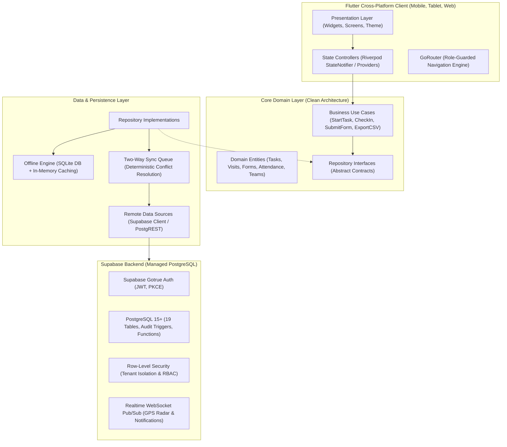
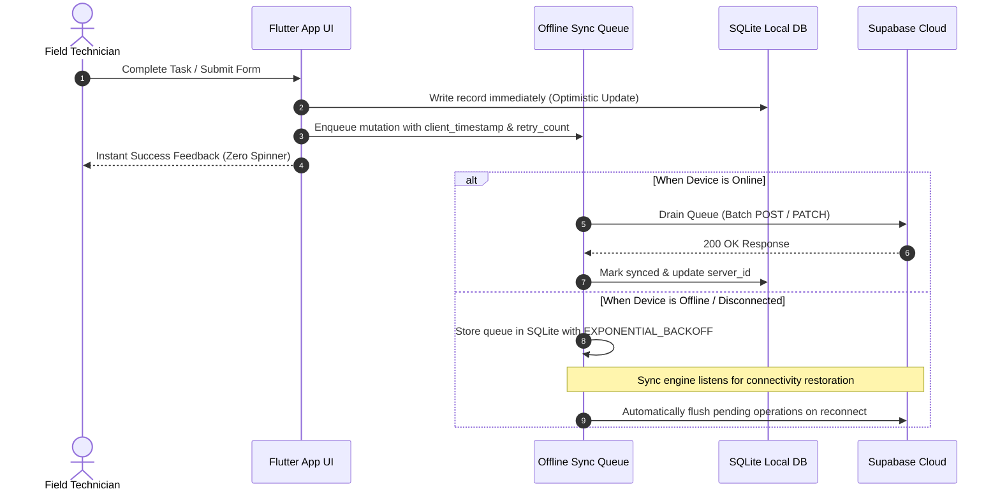

# FieldOps System Architecture & Technical Design

FieldOps is an enterprise-grade, offline-first Field Service and Operations Management platform built with Flutter, Riverpod, SQLite, and Supabase (PostgreSQL with Row-Level Security).

---

## 🏛️ High-Level Architecture Diagram

---

## 🧩 Architectural Principles

### 1. Clean Architecture Layers
The codebase follows Uncle Bob's Clean Architecture pattern with strict unidirectional dependencies:

* **Domain Layer (`lib/features/*/domain/`)**:
  - Contains core enterprise business rules, independent of any UI or framework libraries.
  - Composed of **Entities** (immutable data models with domain validation rules) and **Use Cases** (interactors executing specific business workflows).
  - Defines **Repository Interfaces** that dictate the contract without knowing how data is fetched or stored.

* **Data Layer (`lib/features/*/data/`)**:
  - Implements the repository contracts from the Domain Layer.
  - Divided into **Local Data Sources** (SQLite / SharedPreferences for offline-first resilience) and **Remote Data Sources** (Supabase PostgREST client).
  - Handles JSON serialization, schema migrations, and entity mapping.

* **Presentation Layer (`lib/features/*/presentation/`)**:
  - UI components (Flutter `StatelessWidget`, `StatefulWidget`, and `ConsumerWidget`).
  - State management powered by **Riverpod** (`StateNotifierProvider` and `Provider`).
  - Strict separation: UI widgets never interact with repositories or network clients directly; they only trigger notifier methods or watch reactive state.

---

## 📶 Offline-First Engine & Sync Architecture

Field service technicians frequently operate in basements, rural sites, or locations with zero cellular coverage. FieldOps guarantees 100% operational continuity offline.

### Deterministic Conflict Resolution
When concurrent modifications occur between the mobile app (offline) and the office dispatch web dashboard:
1. **Timestamps**: Uses UTC ISO-8601 timestamps (`client_timestamp` vs `server_timestamp`).
2. **Strategy**: **Field-Level Last-Write-Wins (LWW)** with administrative override.
3. **Audit Trail**: Discarded conflict state is persisted into `public.activity_logs` with `entity_type: 'conflict'` for operational accountability.

---

## 📍 GPS Geofencing & Location Engine

FieldOps incorporates a dedicated GPS distance and geofence verification engine located in `lib/core/location/`:

* **Mathematical Formula**: Implements the **Haversine Formula** for great-circle distance between two geographic coordinates:
  $$d = 2r \arcsin \left( \sqrt{\sin^2\left(\frac{\Delta \phi}{2}\right) + \cos(\phi_1)\cos(\phi_2)\sin^2\left(\frac{\Delta \lambda}{2}\right)} \right)$$
* **Radius Enforcement**: Customer job sites define a configurable `radius_meters` (default: 100m).
* **Operational Guards**:
  - Technicians cannot execute job check-in if GPS indicates they are outside the designated radius.
  - GPS coordinates and accuracy tolerances are recorded with every attendance record, visit, and dynamic form submission.

---

## 🛡️ Security & Multi-Tenancy Architecture

Multi-tenancy is enforced directly inside the database kernel via PostgreSQL **Row-Level Security (RLS)**:

1. **Tenant Isolation**: Every query automatically evaluates `organization_id = (SELECT organization_id FROM public.users WHERE id = auth.uid())`.
2. **Role Hierarchy**:
   - **`owner` / `admin`**: Full administrative access to staff directory, role permissions, organization settings, dispatch units, and reporting.
   - **`manager`**: Operational control over task creation, team scheduling, technician assignments, live radar view, and CSV export.
   - **`employee`**: Restricted exclusively to assigned tasks, own GPS attendance, assigned team visits, and form submissions.
3. **Zero Data Leakage**: Even if a malicious client manually executes a raw REST query, the PostgreSQL engine filters out rows belonging to other tenants before returning bytes over the wire.
