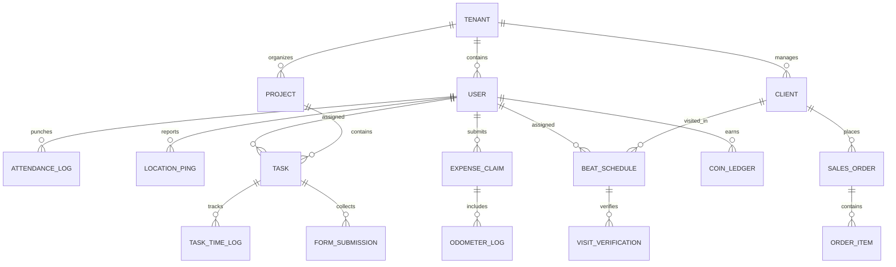

# 🏢 Comprehensive Audit: TaskOPad vs Unolo & Combined Next-Gen Platform Blueprint

---

## 📌 Executive Summary

This document provides a full-scale architectural and functional audit of two leading workforce and field management applications:
1. **TaskOPad** (`com.taskopad.taskopad` - v3.7.34): A Project, Task, and Attendance Management platform built with Flutter.
2. **Unolo** (`smartsense.co.in.sensephone` - v7.09): An Enterprise Field Force Automation, Sales, and Tracking platform built natively with Android Kotlin & Jetpack Compose.

Furthermore, this document presents the **Combined Platform Blueprint**: an enterprise-grade, offline-first, AI-powered Field Force & Task Management platform that integrates the best capabilities of both platforms into a unified architecture.

---

## 🔍 Part 1: TaskOPad In-Depth Audit

### 1.1 Product Overview & Target Audience
* **Company / Brand:** TaskOPad (Ahmedabad, India).
* **Core Value Proposition:** All-in-one Project, Daily Task, and Employee Productivity suite with smart biometric/geofenced attendance.
* **Target Industries:** Digital agencies, IT services, consulting, construction sites, manufacturing, and hybrid office/remote teams.
* **Pricing Model:** ~₹200 - ₹300 per user/month, with 15-day free trial.

### 1.2 Core Feature Modules
1. **Project & Task Management:**
   * Milestones, Task Dependencies, and Sub-tasks.
   * Kanban Board view, List view, and Calendar view.
   * Priority levels (High, Medium, Low, Critical), custom statuses (To Do, In Progress, In Review, Done).
   * Recurring tasks (daily, weekly, monthly routines).
2. **Smart Attendance & Leave Management:**
   * **On-Device Face Recognition:** Employs an embedded `facenet.tflite` neural network model combined with Google ML Kit Face Detection. Face matching occurs instantly without uploading images to cloud every time.
   * **Geofencing:** Allowed check-in radius around office/site coordinates.
   * **Attendance Regularization:** Request flow for missed punches with manager approval.
   * **Leave Tracking:** Leave balances, approvals, and holiday calendar.
3. **Timesheets & Productivity:**
   * Task timer and manual timesheet entry.
   * Daily/Weekly productivity reports, idle time tracking, and billable vs non-billable hours.
4. **Collaboration & Rich Notes:**
   * Integrated task-level discussions and team chat.
   * File attachments (documents, images, PDFs).
   * Rich text editing using Flutter Quill.

### 1.3 Technical Architecture (APK Analysis)
* **Application Framework:** **Flutter** (Dart AOT compiled).
* **Android Wrapper:** Kotlin 1.9.22, Android Gradle Plugin 8.6.0, Gradle 8.7.
* **SDK Targets:** Min SDK 23 (Android 6.0 Marshmallow) / Target SDK 35 (Android 15).
* **AI & Machine Learning:**
  * Embedded Model: `assets/flutter_assets/assets/facenet.tflite` (FaceNet 128/512-d embeddings).
  * Detection: Google ML Kit Face Detection (`play-services-mlkit-face-detection`).
* **Plugins & Native Bridges:**
  * Geolocation: `com.baseflow.geolocator`
  * Media: `io.flutter.plugins.imagepicker`, `record_web` (audio recording)
  * File sharing: `dev.fluttercommunity.plus.share`
  * Notifications: Firebase Cloud Messaging (`io.flutter.plugins.firebase.messaging`)
* **Code Hardening:** R8 / ProGuard minification & obfuscation.

---

## 🔍 Part 2: Unolo In-Depth Audit

### 2.1 Product Overview & Target Audience
* **Company / Brand:** Smartsense Technologies Pvt. Ltd. (Gurugram, India).
* **Core Value Proposition:** End-to-end Field Force Automation (SFA/FFA), real-time executive tracking, client visit verification, distance-based travel claims, and field sales order booking.
* **Target Industries:** FMCG, Pharmaceuticals, Field Sales, Banking & Insurance (DSA), Logistics & Delivery, Facilities Management & Security Guards.
* **Pricing Model:** ~$4 - $5 / ₹325 per user/month, tiered enterprise plans (Starter, Standard, Pro).

### 2.2 Core Feature Modules (Decompiled GraphQL & Component Audit)
1. **Permanent Journey Plan (PJP) & Beat Planning:**
   * Pre-scheduled daily/weekly store visit plans (`AllBeatsQuery`, `BeatPlanByIdQuery`).
   * Route optimization for shortest travel path (`OptimizeVisitsQuery`).
   * Ad-hoc visits vs scheduled beat compliance.
2. **Geo-tracking & Anti-Spoofing:**
   * Real-time GPS timeline with breadcrumb tracking.
   * Activity recognition (Google Activity Recognition API) to differentiate vehicle vs walking vs stationary.
   * Mock location detection and battery saver tamper alerts.
   * Batch GPS syncing (`insert_location_batch`) to minimize battery and mobile data.
3. **Conveyance & Odometer OCR Automation:**
   * Camera-based Odometer photo capture.
   * **Google ML Kit Text Recognition (OCR)** (`OdoReadingSummaryActivity`) automatically reads digits from vehicle odometer at day start and day end.
   * Cross-verification: GPS distance vs Odometer OCR distance to prevent fuel claim fraud.
4. **Dynamic Forms Engine V2 (`formsV2`):**
   * Configurable field survey forms (`syncFormMetadata`, `SyncCompletedFormDatav2Mutation`).
   * Mandatory geo-tagged photo capture, digital signatures, dropdowns, dependent conditional fields.
5. **Field Sales & Secondary Order Booking:**
   * Product catalogue & SKU management (`SyncSKUMutation`).
   * Order capture per client/retailer (`SyncOrdersMutation`, `GetOrdersByClientIdQuery`).
6. **Expense & Advance Management:**
   * Expense categories with daily/monthly company limits (`GetCompanyLevelExpenseLimitForEmployeeQuery`).
   * Cash advances ledger (`GetAdvanceLedgerQuery`, `SyncAdvancesMutation`).
7. **Gamification & Rewards:**
   * In-app coins and reward cycles (`GetCoinLeaderboardQuery`, `GetCoinActivityFeedQuery`).
   * Badges, rankings, and peer cheering (`CheerActivity`).
8. **Specialized Security Guard Patrols:**
   * Guard checkpoint tour assignment (`GetCurrentGuardAssignmentV2`), QR code checkpoint scanning.

### 2.3 Technical Architecture (APK Analysis)
* **Application Framework:** **Pure Native Android (100% Kotlin)**.
* **UI Toolkit:** **Jetpack Compose (Material 3)** + ViewBinding.
* **Architecture:** MVI / MVVM with Clean Architecture, Kotlin Coroutines & Flow.
* **Build System:** Kotlin 1.9.25, AGP 8.7.2, Gradle 8.9.
* **API & Networking:**
  * **GraphQL Engine:** Apollo GraphQL Client (`https://apollo-hermes.unolo.com/graphql`) with 212+ registered operations.
  * HTTP & REST: OkHttp3, Retrofit.
  * Push Messaging: OneSignal (`api.onesignal.com`) + Firebase Cloud Messaging.
* **Persistence & Caching:** Jetpack DataStore + Room / SQLite for robust offline-first queuing.
* **Security & Device Attestation:** Google Play Integrity API, Recaptcha, FIDO Biometric Auth.

---

## ⚖️ Part 3: Comparative Analysis Matrix

| Dimension | TaskOPad | Unolo | Best-of-Both Recommendation |
| :--- | :--- | :--- | :--- |
| **Primary Focus** | Project & Task Management | Field Sales & Executive Tracking | **Unified Operations Platform** |
| **Mobile Tech** | Flutter (Dart) | Native Android (Kotlin + Jetpack Compose) | **Flutter** (for iOS+Android speed) or **Kotlin Multiplatform** |
| **API Architecture**| REST API | Apollo GraphQL + REST | **GraphQL + WebSockets** (Ideal for real-time + selective sync) |
| **Face Recognition**| **Local On-Device (FaceNet TFLite)** | Cloud/Selfie Verification | **On-Device FaceNet TFLite + Cloud Verification Fallback** |
| **Travel & Mileage**| Basic GPS punch | **Odometer ML Kit OCR + GPS cross-check** | **Dual verification: OCR Odometer + GPS Route** |
| **Field Sales / CRM**| Not available | **Beat Plan, SKU Orders, Client Duplication** | **Integrated Mini-CRM + Beat & Route Planner** |
| **Project Management**| **Kanban, Milestones, Timesheets** | Basic custom tasks | **Full Kanban + Field Action Items** |
| **Form Builder** | Static task fields | **Dynamic Form Engine V2** | **No-Code Dynamic Form Builder with Conditions** |
| **Gamification** | Not available | **Leaderboards, Coins, Cheers** | **Gamified KPI & Coin Reward Engine** |
| **Battery Life** | Standard GPS polling | **Smart batching + Activity Recognition** | **Activity Recognition (Drive/Walk/Still) + Batched Sync** |

---

## 🚀 Part 4: Combined Next-Gen Platform Blueprint ("OmniForce & TaskHub")

### 4.1 System Architecture Overview

```mermaid
graph TD
    subgraph ClientLayer [Client Applications]
        MA[Mobile App: Flutter / KMP]
        WA[Web Admin & Dispatch Console: React / Next.js]
        KP[Kiosk Attendance Mode: Android Tablet]
    end

    subgraph APIGatewayLayer [Gateway & Edge]
        GW[API Gateway: Envoy / Kong]
        AUTH[Auth Service: OAuth2 / JWT / Biometrics]
        WS[WebSocket / GraphQL Subscriptions Server]
    end

    subgraph MicroservicesLayer [Core Microservices]
        MS_AUTH[Identity & Organization Service]
        MS_TASK[Project & Task Engine - Kanban/Gantt]
        MS_ATTEND[Attendance & Face Matching Engine]
        MS_FIELD[Field Force, PJP & Beat Planner]
        MS_TRACK[Location Stream & Battery-Optimized Ingestion]
        MS_FORMS[Dynamic No-Code Form Engine]
        MS_EXP[Expense, Odo OCR & Conveyance Service]
        MS_SALES[Sales CRM, Client & SKU Order Booking]
        MS_GAME[Gamification, Coins & Leaderboards]
    end

    subgraph StorageLayer [Data & Storage]
        PG[(PostgreSQL + PostGIS - Master DB & Geometries)]
        REDIS[(Redis - Live Locations, GeoSets & Caching)]
        CLICK[(ClickHouse / TimescaleDB - Location Breadcrumbs)]
        S3[Object Storage: MinIO / S3 - Photos, Receipts, Models]
    end

    MA --> GW
    WA --> GW
    KP --> GW

    GW --> AUTH
    GW --> WS
    GW --> MS_AUTH
    GW --> MS_TASK
    GW --> MS_ATTEND
    GW --> MS_FIELD
    GW --> MS_TRACK
    GW --> MS_FORMS
    GW --> MS_EXP
    GW --> MS_SALES
    GW --> MS_GAME

    MS_TRACK --> REDIS
    MS_TRACK --> CLICK
    MS_TASK --> PG
    MS_ATTEND --> PG
    MS_FIELD --> PG
    MS_FORMS --> PG
    MS_EXP --> PG
    MS_SALES --> PG
    MS_GAME --> PG
    MS_EXP --> S3
    MS_ATTEND --> S3
```

---

### 4.2 Unified Core Data Schema (Entity Relationships)

---

### 4.3 Key Innovation Features to Implement

#### 1. Smart Hybrid Attendance (TaskOPad Face AI + Unolo Geofence)
* **Offline-First Face Matching:** Download employee's 128-float embedding on device login. Perform cosine similarity match via TFLite locally in `<150ms`.
* **Liveness Detection:** Blink detection and head rotation prompt via ML Kit to prevent photo-spoofing.
* **Geofence Fallback:** If outside geofence, prompt for "Remote Punch" requiring mandatory reason and manager approval.

#### 2. Battery-Saver Intelligent Tracking (Unolo Architecture)
* Instead of running GPS constantly, listen to Android/iOS **Activity Recognition**:
  * **STILL (Sitting/Stationary):** Sleep GPS, wake up every 15 minutes or when accelerometer detects movement.
  * **WALKING / RUNNING:** Fetch GPS every 2 minutes.
  * **IN_VEHICLE:** Fetch GPS every 30-60 seconds for route fidelity.
* **Batch Ingestion:** Cache points in SQLite and send in batches of 20-50 points (`insert_location_batch`).

#### 3. AI Fraud-Proof Conveyance Engine (Unolo Odometer OCR + TaskOPad Approvals)
* **Day Start Punch:** Driver captures vehicle odometer. On-device Google ML Kit OCR extracts the numeric odometer reading and stores timestamp + GPS coordinates.
* **Day End Punch:** Final odometer photo + OCR reading.
* **Validation Algorithm:**
  $$\Delta D_{claimed} = Odo_{end} - Odo_{start}$$
  $$\Delta D_{gps} = \sum \text{Haversine}(p_i, p_{i+1})$$
  $$\text{Discrepancy} = |\Delta D_{claimed} - \Delta D_{gps}|$$
  If discrepancy $> 15\%$, flag for manager review with map overlay!

#### 4. Dual Workflow: Project Tasks (TaskOPad) + Field Visits (Unolo)
* Desk/office staff use **Kanban Boards**, **Milestones**, and **Timesheets**.
* Field staff receive **Beat Plans / Customer Visits** that display as action cards with built-in navigation, dynamic forms, and order collection.

#### 5. Dynamic Form Builder & Field CRM
* Drag-and-drop form builder on Web Admin:
  * Barcode / QR scanner input
  * Geo-stamped photo capture (watermarked with date, time, lat/long)
  * Signature pad
  * Conditional branching (e.g. *If Client Interested -> Show Product Pitch form*)
* Client duplicate checker (`PerformClientDupCheck`) via phone and GST number.

#### 6. Gamification Engine (Coins, Ranks & Cheers)
* Earn coins for: On-time attendance (+10), Completed visits (+20), Sales order above target (+50).
* Leaderboard view (daily, weekly, monthly).
* Redeemable against gift cards or company perks.

---

### 4.4 Recommended Tech Stack for Development

1. **Mobile Application (Cross-Platform):**
   * **Framework:** **Flutter 3.x** (provides rapid multi-platform delivery for Android and iOS).
   * **Local Storage:** **Isar Database** or **Drift** (SQLite) for ultra-fast offline caching.
   * **State Management:** **Riverpod** or **Bloc**.
   * **ML / OCR:** Google ML Kit (Text Recognition + Face Detection) + TFLite Flutter runtime.
   * **Background Services:** `flutter_background_geolocation` (Transistor Software) for industry-standard battery optimization.

2. **Backend Services & API:**
   * **Language:** **Go (Golang)** or **Node.js (TypeScript / NestJS)**.
   * **API Layer:** **GraphQL (Apollo/Mercurius)** for flexible mobile sync + **REST** for webhook integrations.
   * **Realtime:** WebSockets for live manager tracking dashboard.
   * **Message Broker:** **RabbitMQ** or **Apache Kafka** for processing location streams and background notifications.

3. **Web Admin & Manager Dashboard:**
   * **Framework:** **Next.js (React 19, TypeScript, Tailwind CSS)**.
   * **Map Engine:** **Mapbox GL JS** or **Google Maps JavaScript API** with live vehicle clustering and historical playback.
   * **UI Components:** **shadcn/ui** with Lucide icons.

4. **Database & Infrastructure:**
   * **Primary Database:** **PostgreSQL 16** with **PostGIS** extension (for geofencing, polygon queries, distance calculation).
   * **Time-Series / Stream Storage:** **TimescaleDB** or **ClickHouse** (stores millions of location pings efficiently).
   * **Cache:** **Redis 7** (live locations and session store).
   * **Deployment:** Docker, Kubernetes (K8s), AWS/GCP or self-hosted bare metal.

---

### 4.5 Phased Implementation Roadmap

* **Phase 1 (MVP - 4 to 6 Weeks):**
  * Core Authentication, Tenant/Role hierarchy.
  * Geofenced Attendance + Face Matching (TFLite).
  * Task Management (Kanban, assignment, status tracking).
  * Basic real-time GPS tracking and Web Admin Dashboard.
* **Phase 2 (Field Operations - 4 Weeks):**
  * Dynamic Form Engine V2.
  * Odometer OCR scan and Conveyance Claim calculation.
  * Beat Planning (PJP) and Client Store Visit verification.
* **Phase 3 (Enterprise & Commercial - 4 Weeks):**
  * SKU Catalog and Sales Order booking.
  * Route Optimization algorithm (`OptimizeVisits`).
  * Gamification (Coins, Leaderboard, Cheers).
  * HRMS / Payroll export integrations.
