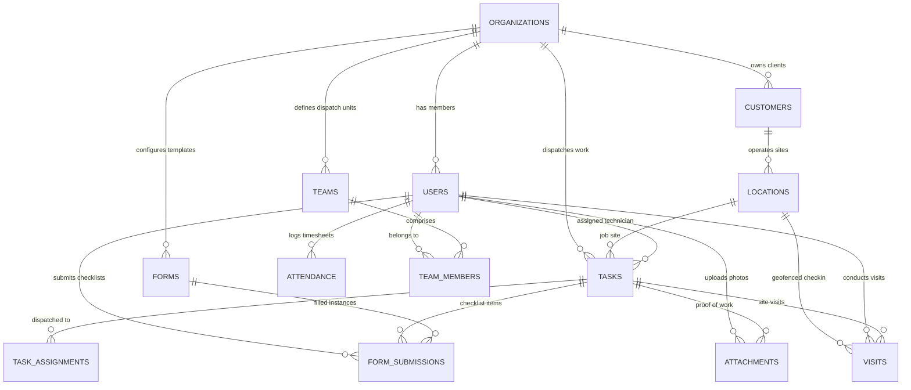

# FieldOps Database Schema & Data Dictionary

The FieldOps database backend is built on **PostgreSQL 15+** managed via Supabase. It uses **19 tables and views** with complete Row-Level Security (RLS) multi-tenant isolation, composite performance indexes, and automatic audit triggers.

---

## 🗺️ Entity Relationship (ER) Diagram

---

## 🗄️ Database Tables & Schema Definitions

### 1. `public.organizations`
Stores tenant companies and operational business configurations.
* `id` (`UUID`, PK): Unique organization identifier.
* `name` (`TEXT`): Company business name.
* `industry` (`TEXT`): Business category (e.g. Field Services, HVAC, Plumbing).
* `timezone` (`TEXT`): Primary timezone (default: `'UTC'`).
* `currency` (`TEXT`): Operating currency (default: `'USD'`).
* `geofence_default_radius` (`INT`): Default arrival tolerance in meters (default: `100`).
* `auto_checkout_hours` (`INT`): Max allowable shift duration before automated checkout (default: `10`).
* `require_photo_on_completion` (`BOOLEAN`): Mandatory camera proof policy.
* `require_gps_on_checkin` (`BOOLEAN`): Mandatory GPS fix policy.
* `created_at` / `updated_at` (`TIMESTAMPTZ`).

---

### 2. `public.users`
User profiles linked directly to Supabase Auth (`auth.users`).
* `id` (`UUID`, PK, FK -> `auth.users.id` ON DELETE CASCADE).
* `organization_id` (`UUID`, FK -> `public.organizations.id` ON DELETE CASCADE).
* `name` (`TEXT`): Full name.
* `email` (`TEXT`, Unique): Work email address.
* `phone` (`TEXT`): Contact phone number.
* `role` (`TEXT`): Role identifier (`owner`, `admin`, `manager`, `employee`).
* `avatar_url` (`TEXT`): Optional profile picture URL.
* `status` (`TEXT`): Account lifecycle state (`active`, `inactive`, `suspended`).
* `created_at` / `updated_at` (`TIMESTAMPTZ`).

---

### 3. `public.teams` & `public.team_members`
Dispatch units, operational squads, and assigned technicians.
* **`teams`**:
  * `id` (`UUID`, PK).
  * `organization_id` (`UUID`, FK -> `organizations.id`).
  * `name` (`TEXT`): Unit title (e.g. "Rapid Response Alpha").
  * `description` (`TEXT`): Unit charter.
  * `lead_manager_id` (`UUID`, FK -> `users.id`): Squad commander.
  * `color_hex` (`TEXT`): UI branding badge color (default: `'#0288D1'`).
* **`team_members`**:
  * `id` (`UUID`, PK).
  * `team_id` (`UUID`, FK -> `teams.id` ON DELETE CASCADE).
  * `user_id` (`UUID`, FK -> `users.id` ON DELETE CASCADE).
  * `created_at` (`TIMESTAMPTZ`).

---

### 4. `public.customers` & `public.locations`
Client roster, service locations, and geofence perimeters.
* **`customers`**:
  * `id` (`UUID`, PK).
  * `organization_id` (`UUID`, FK -> `organizations.id`).
  * `name` (`TEXT`): Customer / Enterprise account name.
  * `email` / `phone` / `address` (`TEXT`).
  * `notes` (`TEXT`): Account instructions.
* **`locations`**:
  * `id` (`UUID`, PK).
  * `customer_id` (`UUID`, FK -> `customers.id`).
  * `name` (`TEXT`): Facility name (e.g. "Main Warehouse - Hub A").
  * `latitude` / `longitude` (`DOUBLE PRECISION`): Coordinates.
  * `radius_meters` (`INT`): Geofence perimeter in meters (e.g. `150`).
  * `type` (`TEXT`): Location type (`site`, `branch`, `hq`).

---

### 5. `public.tasks` & `public.task_assignments`
The central operational work order engine.
* `id` (`UUID`, PK).
* `organization_id` (`UUID`, FK -> `organizations.id`).
* `title` (`TEXT`): Work order headline.
* `description` (`TEXT`): Detailed instructions.
* `priority` (`TEXT`): `LOW`, `MEDIUM`, `HIGH`, `URGENT`.
* `status` (`TEXT`): `DRAFT`, `ASSIGNED`, `ACCEPTED`, `IN_PROGRESS`, `COMPLETED`, `CANCELLED`, `OVERDUE`.
* `customer_id` (`UUID`, FK -> `customers.id`).
* `location_id` (`UUID`, FK -> `locations.id`).
* `created_by` (`UUID`, FK -> `users.id`).
* `assigned_to` (`UUID`, FK -> `users.id`): Primary assigned technician.
* `scheduled_start` / `scheduled_end` (`TIMESTAMPTZ`).
* `actual_start` / `actual_end` (`TIMESTAMPTZ`).
* `requires_gps` (`BOOLEAN`): Enforces GPS check-in verification.
* `requires_photo` (`BOOLEAN`): Enforces photo proof before task can be marked complete.
* `requires_form` (`BOOLEAN`): Enforces checklist submission.

---

### 6. `public.attendance`
GPS-verified daily timesheets and work duration.
* `id` (`UUID`, PK).
* `organization_id` (`UUID`, FK -> `organizations.id`).
* `user_id` (`UUID`, FK -> `users.id`).
* `date` (`DATE`): Work day date.
* `check_in_at` (`TIMESTAMPTZ`): First clock-in timestamp.
* `check_in_latitude` / `check_in_longitude` (`DOUBLE PRECISION`): GPS fix.
* `check_out_at` (`TIMESTAMPTZ`): Shift conclusion timestamp.
* `check_out_latitude` / `check_out_longitude` (`DOUBLE PRECISION`).
* `total_minutes` (`INT`): Total elapsed work time in minutes.
* `status` (`TEXT`): `PRESENT`, `ABSENT`, `HALF_DAY`, `ON_LEAVE`.
* Unique Constraint: `(user_id, date)` prevents duplicate records per employee per day.

---

### 7. `public.forms` & `public.form_submissions`
Dynamic custom form builder templates and mobile inspection reports.
* **`forms`**:
  * `id` (`UUID`, PK).
  * `organization_id` (`UUID`, FK -> `organizations.id`).
  * `name` (`TEXT`): Form title.
  * `description` (`TEXT`): Form purpose.
  * `schema` (`JSONB`): Array of dynamic fields (`text`, `number`, `select`, `checkbox`, `date`, `multiline`).
* **`form_submissions`**:
  * `id` (`UUID`, PK).
  * `form_id` (`UUID`, FK -> `forms.id`).
  * `task_id` (`UUID`, FK -> `tasks.id`): Associated work order.
  * `user_id` (`UUID`, FK -> `users.id`): Submitting technician.
  * `latitude` / `longitude` (`DOUBLE PRECISION`): Auto-captured GPS location.
  * `data` (`JSONB`): Key-value responses matching form field IDs.
  * `submitted_at` (`TIMESTAMPTZ`).

---

### 8. `public.visits` & `public.attachments`
Proof of work photos, geofenced job site arrivals, and digital signatures.
* **`visits`**:
  * `id` (`UUID`, PK).
  * `task_id` (`UUID`, FK -> `tasks.id`).
  * `user_id` (`UUID`, FK -> `users.id`).
  * `location_id` (`UUID`, FK -> `locations.id`).
  * `check_in_at` / `check_out_at` (`TIMESTAMPTZ`).
  * `check_in_latitude` / `check_in_longitude` (`DOUBLE PRECISION`).
* **`attachments`**:
  * `id` (`UUID`, PK).
  * `task_id` (`UUID`, FK -> `tasks.id`).
  * `uploaded_by` (`UUID`, FK -> `users.id`).
  * `type` (`TEXT`): `photo`, `signature`, `document`.
  * `storage_path` (`TEXT`): Cloud storage key.
  * `metadata` (`JSONB`): Exif metadata, device info, signature data.

---

### 9. `public.notifications`, `public.sync_queue`, `public.activity_logs`
Realtime notifications, offline sync queue mutations, and immutable audit trails.

---

## 🔒 Row-Level Security (RLS) Policies Summary

All tables enforce Row-Level Security:

| Table | SELECT Policy | INSERT Policy | UPDATE / DELETE Policy |
| :--- | :--- | :--- | :--- |
| **`organizations`** | Org members view own tenant | Admins / System | Admins only |
| **`users`** | Org members view staff list | Admins only | Admins update, Users edit profile |
| **`tasks`** | Org Managers + Assigned Technicians | Managers & Admins | Assigned tech & Managers |
| **`customers`** | All Org members | Managers & Admins | Managers & Admins |
| **`attendance`** | Own user records + Managers | Own user only (`auth.uid()`) | Own user + Managers |
| **`forms`** | All Org members | Managers & Admins | Managers & Admins |
| **`form_submissions`** | Submitter + Managers | Authenticated Org techs | Managers |
| **`teams`** | All Org members | Admins & Managers | Admins |
