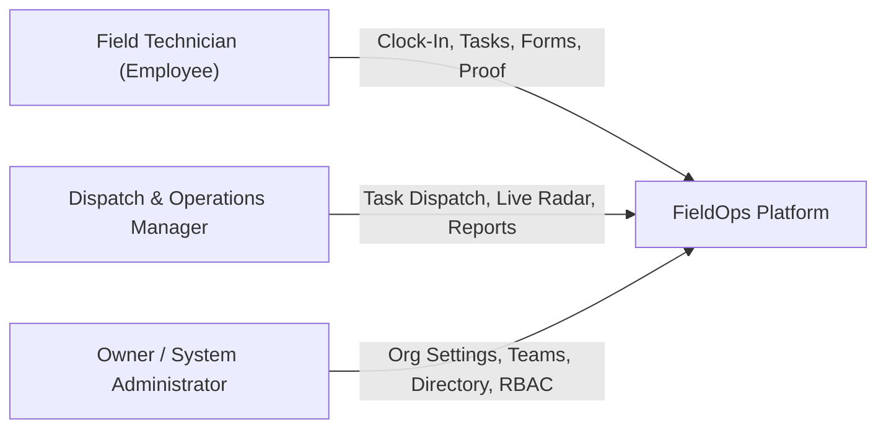

# FieldOps - Product Requirements Document (PRD)

* **Product Name**: FieldOps
* **Document Version**: 1.0 (Production Release)
* **Status**: Approved & Implemented
* **Target Platforms**: Android, iOS, Web, Desktop (Linux, macOS, Windows)

---

## 1. Executive Summary & Vision

Small and medium-sized field service businesses (HVAC, plumbing, commercial cleaning, electrical maintenance, solar installation, pest control, facility audits) struggle with fragmented operational tooling. Dispatching is often handled via phone calls, attendance through manual punch-cards or messaging apps, customer visit verification through trust alone, and site inspections via paper checklists.

**FieldOps** provides an integrated, offline-first mobile and web platform that unifies:
1. **Task Dispatch & Scheduling**
2. **GPS Geofenced Visit & Arrival Verification**
3. **Automated Attendance & Shift Timesheets**
4. **Custom Dynamic Inspection Forms**
5. **Tamper-Evident Proof of Work (Timestamped Photos & Digital Signatures)**
6. **Real-Time Technician Radar & Dispatch Command Center**
7. **Multi-Tenant Administration with Granular Role-Based Access Control (RBAC)**

---

## 2. Target Market & User Personas

### 2.1 Target Verticals
* Commercial & Residential HVAC & Mechanical Contractors
* Electrical & Renewable Energy (Solar/Wind) Maintenance
* Plumbing, Pipefitting & Utility Field Services
* Commercial Property Management & Facility Inspection
* Industrial Equipment Maintenance & Repair Operations

### 2.2 User Personas

#### 👷 Persona 1: Field Technician / Service Engineer (Employee)
* **Demographics**: Mobile-first field worker, frequently operates in basements, roofs, and rural job sites with poor connectivity.
* **Core Needs**:
  - Clear list of today's work orders with customer contacts and navigation links.
  - 1-tap clock-in/out for daily work shift without paper logbooks.
  - Ability to complete job checklists, take photos, and get customer signatures offline.
  - Zero application freezes or data loss when connectivity drops.

#### 👨‍💼 Persona 2: Dispatch & Operations Manager
* **Demographics**: Office or desk-based supervisor managing a fleet of 5 to 50 field technicians.
* **Core Needs**:
  - Live radar view of technician locations, arrival statuses, and workload distribution.
  - Rapid work order creation and assignment with emergency dispatch capabilities.
  - Instant visibility into completed visit proof (photos, customer signatures, timestamps).
  - One-click RFC-4180 CSV export for payroll and billing integration.

#### 👑 Persona 3: Business Owner / System Administrator
* **Demographics**: Business owner or IT manager overseeing company-wide operations and compliance.
* **Core Needs**:
  - Multi-tenant data segregation guaranteeing zero leaks between customer accounts.
  - Configurable business rules (default geofence radii, mandatory photo policies).
  - Customizable dispatch squads and granular role permissions matrix.

---

## 3. Functional Requirements by Module

### Module 1: Authentication, Multi-Tenancy & RBAC
* **FR-1.1**: Email & password authentication with secure JWT tokens and PKCE flow.
* **FR-1.2**: Complete multi-tenant isolation where all entities are scoped to `organization_id`.
* **FR-1.3**: 4 distinct role tiers (`owner`, `admin`, `manager`, `employee`).
* **FR-1.4**: Dynamic role permissions matrix permitting granular capability toggling.
* **FR-1.5**: 1-Tap quick demo persona selection for rapid staging and evaluation.

### Module 2: Tasks & Work Order Lifecycle
* **FR-2.1**: Work order creation with Title, Description, Priority (`LOW`, `MEDIUM`, `HIGH`, `URGENT`), and Schedule dates.
* **FR-2.2**: Strict lifecycle state machine:
  $$\text{DRAFT} \longrightarrow \text{ASSIGNED} \longrightarrow \text{ACCEPTED} \longrightarrow \text{IN\_PROGRESS} \longrightarrow \text{COMPLETED} \ (\text{or } \text{CANCELLED})$$
* **FR-2.3**: Mandatory proof flags (Require GPS, Require Photo, Require Checklist).
* **FR-2.4**: Filter tasks by status tab (*All*, *To Do*, *In Progress*, *Completed*), priority, or search query.

### Module 3: Customers, Locations & Haversine GPS Geofencing
* **FR-3.1**: Customer account directory with contact details, address, and notes.
* **FR-3.2**: Multi-site location support per customer with latitude, longitude, and geofence radius in meters.
* **FR-3.3**: Haversine distance validation enforcing that technicians are physically within the designated site radius before allowing check-in.
* **FR-3.4**: Visit duration tracking with automated check-in and check-out timestamps.

### Module 4: Dynamic Custom Form Builder & Submissions
* **FR-4.1**: Visual drag-and-drop form builder supporting 6 field types:
  - Short Text
  - Multiline Notes
  - Number / Decimal Readings
  - Date Picker
  - Dropdown Select
  - Boolean Checkbox
* **FR-4.2**: Client-side dynamic form validation with required field enforcement.
* **FR-4.3**: Automatic GPS tagging and task linkage on every form submission.
* **FR-4.4**: Draft auto-save to prevent data loss if technician switches apps.

### Module 5: GPS Attendance & Timesheets
* **FR-5.1**: Daily clock-in/out with automated coordinates capture.
* **FR-5.2**: Unique constraint preventing duplicate attendance records per technician per calendar day.
* **FR-5.3**: Real-time shift duration counter displayed on the mobile home screen.
* **FR-5.4**: Manager team timesheet review with status indicators (`PRESENT`, `ABSENT`, `HALF_DAY`, `ON_LEAVE`).

### Module 6: Offline SQLite Database & Two-Way Sync Queue
* **FR-6.1**: Local SQLite persistence for all core entities (Tasks, Attendance, Forms, Visits).
* **FR-6.2**: Optimistic UI updates allowing zero-latency interactions while offline.
* **FR-6.3**: Two-way sync queue capturing mutations with client timestamps and retry counters.
* **FR-6.4**: Deterministic Last-Write-Wins (LWW) conflict resolution with audit logging.

### Module 7: Proof of Work, Photos & Digital Signatures
* **FR-7.1**: Integrated camera capture with metadata tagging (timestamp, technician ID, task ID).
* **FR-7.2**: Interactive vector touch signature pad for customer sign-off.
* **FR-7.3**: Completion lock preventing task closure until all required proof items are satisfied.

### Module 8: Real-Time Field Radar & Notifications
* **FR-8.1**: Interactive map view displaying active field technician positions.
* **FR-8.2**: Color-coded pins indicating technician status (Green = On-Site, Amber = En Route, Grey = Off Shift).
* **FR-8.3**: Instant in-app notifications on task dispatch, status transition, and urgent reassignment.

### Module 9: Operations Analytics & RFC-4180 CSV Export
* **FR-9.1**: Operations KPIs (Completion Rate %, On-Time Rate %, Average Visit Duration, Total Work Hours).
* **FR-9.2**: RFC-4180 compliant CSV export engine for Tasks, Visits, and Attendance timesheets.

### Module 10: Dispatch Units & Administrative Command
* **FR-10.1**: Dispatch squad configuration with custom title, lead manager, and color hex code.
* **FR-10.2**: Company-wide operational rules (default radius, auto-checkout limits, mandatory proof switches).

---

## 4. Non-Functional Requirements (NFR)

| Category | Requirement | Benchmark / Metric |
| :--- | :--- | :--- |
| **Offline Latency** | Local SQLite read/write execution | < 25 ms |
| **Cold Startup** | Splash to interactive screen | < 1.5 seconds |
| **Battery Efficiency** | GPS geofencing & tracking | Smart polling (< 3% battery drain/hour) |
| **Data Durability** | Zero loss of offline form fills | Instant SQLite local commit before sync |
| **UI Responsiveness** | Frame rate on mobile & web | 60 FPS continuous rendering |
| **Security** | Multi-tenant data segregation | PostgreSQL Row-Level Security (RLS) |

---

## 5. Edge Cases & Resilience Strategy

1. **Cellular Blackouts During Job Execution**:
   - The app detects offline state and switches seamlessly to local SQLite storage. All actions succeed without throwing network error banners.
2. **GPS Accuracy Fluctuations**:
   - If GPS accuracy is > 50 meters, the app prompts the technician to wait for a high-accuracy GPS lock before validating geofence boundaries.
3. **Mid-Inspection Application Termination**:
   - Dynamic form drafts are automatically cached in local storage on every keystroke. Upon reopening, the technician is prompted to resume the inspection.
