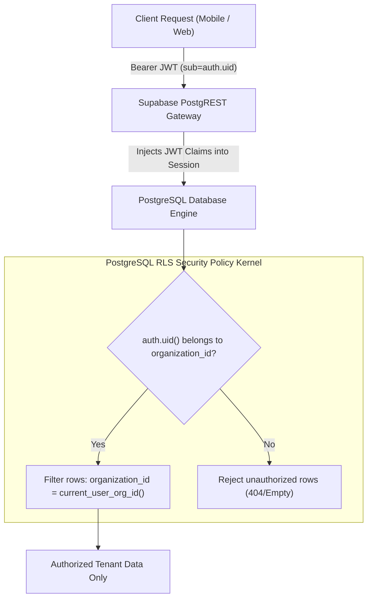

# FieldOps Security, Multi-Tenancy & Compliance Guide

Security and data privacy are foundational to FieldOps. Because field service technicians handle customer addresses, access codes, and photos of private properties, strict multi-tenant isolation and cryptographic safeguards are enforced at every tier.

---

## 🔒 1. Multi-Tenant Isolation via PostgreSQL RLS

FieldOps relies on PostgreSQL **Row-Level Security (RLS)** as its primary security boundary. Rather than depending on client-side filtering or application middleware, the database kernel automatically enforces tenant boundaries.

### Key RLS Functions
* `public.current_user_org_id()`: Returns the calling user's tenant UUID directly from `public.users`.
* `public.is_org_admin()`: Returns true if the calling user holds the `'owner'` or `'admin'` role.
* `public.is_org_manager()`: Returns true if the calling user holds `'owner'`, `'admin'`, or `'manager'`.

---

## 🔑 2. Authentication & Session Security

1. **Protocol**: Uses **OAuth2 Proof Key for Code Exchange (PKCE)** to prevent authorization code injection attacks on mobile devices.
2. **Access Tokens**: Short-lived JSON Web Tokens (JWT) signed with HMAC-SHA256 or ES256 containing user metadata, expiry timestamp, and user UUID.
3. **Password Cryptography**: Passwords are never stored in plaintext. They are salted and hashed using **bcrypt** with a minimum work factor of 10 (`crypt(password, gen_salt('bf', 10))`).
4. **Session Invalidation**: When a user signs out, both client-side storage keys and server-side refresh tokens are invalidated immediately.

---

## 📍 3. Ethical GPS Tracking & Location Privacy

FieldOps complies with modern privacy standards regarding employee geolocation tracking:

* **Shift-Bound Tracking Only**:
  - The application captures GPS coordinates **only** during explicit operational events (Daily Attendance Clock-In/Out, Customer Site Arrival, and Inspection Form Submission).
  - Background location tracking is automatically deactivated when a technician clocks out of their shift.
* **Granular Purpose Justification**:
  - Location accuracy tolerances are displayed transparently to the user before submitting any geofence verification.
* **Geofence Boundary Security**:
  - Customer site coordinates are accessible only to authenticated organization members dispatched to that specific customer site.

---

## 📜 4. Comprehensive Audit Trails (`public.activity_logs`)

All critical operational actions trigger automated database audit logging via PostgreSQL database triggers:

| Entity | Action Logged | Captured Metadata |
| :--- | :--- | :--- |
| **Tasks** | `CREATED`, `STATUS_CHANGED` | Previous status, new status, technician ID, timestamp |
| **Attendance** | `ATTENDANCE_CHECK_IN`, `ATTENDANCE_CHECK_OUT` | Check-in coordinates, shift duration in minutes |
| **Visits** | `VISIT_CHECK_IN`, `VISIT_CHECK_OUT` | Geofence verification status, arrival coordinates |
| **Forms** | `FORM_SUBMITTED` | Form template ID, task ID, submission coordinates |
| **Sync Engine** | `SYNC_CONFLICT_RESOLVED` | Conflict strategy applied, discarded client timestamp |

Audit log entries are immutable: `DELETE` and `UPDATE` operations on `public.activity_logs` are restricted by RLS.
