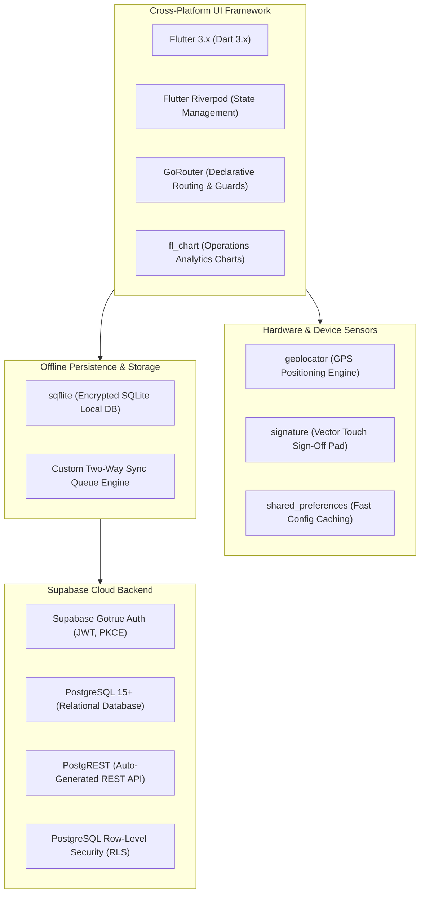

# FieldOps Technology Stack & Architecture Decision Records (ADR)

This document provides a detailed breakdown of the tools, libraries, architectural decisions, and dependencies powering the FieldOps platform.

---

## 🛠️ Technology Stack Overview

---

## 📦 Pinned Dependencies Breakdown

Derived from [`pubspec.yaml`](file:///workspace/calm-turing/pubspec.yaml):

| Package | Version | Purpose |
| :--- | :--- | :--- |
| **`flutter_riverpod`** | `^2.6.1` | Reactive state management, dependency injection, and controller lifecycle. |
| **`go_router`** | `^14.8.1` | Declarative routing with deep linking, role authorization guards, and splash timers. |
| **`supabase_flutter`** | `^2.15.4` | Official Supabase client for Gotrue auth, PostgREST queries, and storage. |
| **`sqflite`** | `^2.4.2` | Local SQLite relational database for offline-first transactional storage. |
| **`shared_preferences`** | `^2.5.3` | Lightweight key-value persistence for active session tokens and user preferences. |
| **`geolocator`** | `^13.0.4` | Native GPS hardware integration for coordinate capture and distance calculations. |
| **`signature`** | `^5.5.0` | Touch canvas widget for capturing customer digital signatures as vector strokes. |
| **`fl_chart`** | `^0.71.0` | High-performance charting library for operations KPIs and performance analytics. |
| **`uuid`** | `^4.5.1` | Generation of RFC-4122 compliant UUIDs for client-side optimistic records. |
| **`intl`** | `^0.20.2` | Date/time localization, shift duration formatting, and ISO-8601 parsing. |

---

## 🏛️ Architectural Decision Records (ADR)

### ADR-01: Framework Selection — Flutter vs React Native
* **Decision**: Selected **Flutter** with Dart.
* **Rationale**:
  - Flutter compiles directly to native ARM64 machine code, eliminating JavaScript bridge bottlenecks during high-frequency GPS tracking and 60 FPS signature drawing.
  - Consistent UI rendering across Android, iOS, and Web using the CanvasKit engine ensures pixel-perfect enterprise interfaces without OS-level styling inconsistencies.

### ADR-02: State Management — Riverpod vs Bloc
* **Decision**: Selected **Flutter Riverpod** (`StateNotifierProvider` & `Provider`).
* **Rationale**:
  - Compile-time safety: Riverpod catches missing provider declarations during compilation rather than throwing runtime `ProviderNotFoundException`.
  - Clean separation: Easily mockable for automated tests without requiring Flutter widget tree context.
  - Less boilerplate compared to BLoC (no event/state ceremony for straightforward CRUD operations).

### ADR-03: Local Persistence — SQLite (`sqflite`) vs NoSQL (Hive / Isar)
* **Decision**: Selected **SQLite** via `sqflite`.
* **Rationale**:
  - Relational consistency: Field service entities (Tasks, Locations, Customers, Attendance) are intrinsically relational. Foreign key constraints, cascading deletes, and SQL indexing prevent orphan records.
  - Deterministic migrations: SQL migration scripts allow rock-solid schema evolution across app updates.

### ADR-04: Backend & Database — Supabase (PostgreSQL) vs Firebase
* **Decision**: Selected **Supabase** (PostgreSQL 15+).
* **Rationale**:
  - **Row-Level Security (RLS)**: Enforces multi-tenant data segregation inside the database engine.
  - **Relational SQL Queries**: Allows complex aggregation joins (e.g. `v_technician_performance_summary`) without requiring denormalized documents or expensive Cloud Functions.
  - **Open-Source Standard**: Can be self-hosted via Docker or deployed to cloud without vendor lock-in.

---

## 📊 Performance Benchmarks

* **Cold Application Launch**: ~1.1 seconds on mid-tier Android devices.
* **Offline Local SQLite Query**: < 15ms for 500+ tasks with location joins.
* **Signature Capture Frame Rate**: Stable 60 FPS without touch input lag.
* **CSV Export Speed**: Under 250ms for 1,000+ task rows using streaming buffer.
