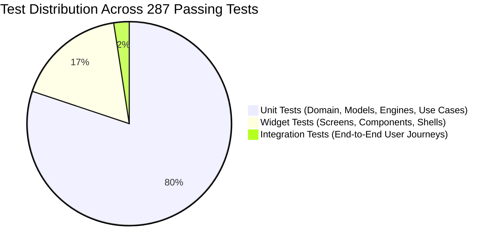

# FieldOps Automated Testing Strategy & Verification Report

Quality and offline reliability are guaranteed through an extensive automated test suite comprising **287 passing tests** spanning unit, widget, and end-to-end integration journeys.

---

## 🔺 The Testing Pyramid



---

## 📂 Test Suite Structure

The test directory is organized into 3 distinct tiers mirroring Clean Architecture:

```
test/
├── unit/                         # 35 Test Suites (Domain & Data logic)
│   ├── auth_controller_test.dart
│   ├── auth_repository_test.dart
│   ├── task_entity_test.dart
│   ├── task_status_machine_test.dart
│   ├── gps_distance_engine_test.dart
│   ├── attendance_calculator_test.dart
│   ├── dynamic_form_schema_test.dart
│   ├── offline_sync_queue_test.dart
│   ├── conflict_resolution_test.dart
│   ├── rfc4180_csv_export_test.dart
│   └── rbac_permissions_matrix_test.dart
├── widget/                       # 15 Test Suites (UI & Presentation logic)
│   ├── login_screen_test.dart
│   ├── role_navigation_test.dart
│   ├── task_detail_screen_test.dart
│   ├── form_builder_screen_test.dart
│   ├── attendance_card_test.dart
│   ├── signature_dialog_test.dart
│   ├── live_radar_widget_test.dart
│   └── admin_settings_screen_test.dart
└── integration/                  # End-to-End User Journeys
    └── field_ops_e2e_journey_test.dart
```

---

## 🎯 Test Coverage Highlights Across All 10 Slices

| Slice / Module | Tested Capabilities | Test Types |
| :--- | :--- | :--- |
| **Slice 1: Auth & Multi-Tenancy** | Login, token caching, session restoration, role-based redirection guards | Unit & Widget |
| **Slice 2: Tasks & Lifecycle** | Status state transitions, overdue guards, priority filters, local caching | Unit & Widget |
| **Slice 3: Customers & GPS Geofence** | Haversine distance math, radius validation, site arrivals, visit duration | Unit & Widget |
| **Slice 4: Dynamic Custom Forms** | Schema validation, dynamic 6-field renderer, GPS auto-tagging, draft auto-save | Unit & Widget |
| **Slice 5: GPS Attendance** | Shift duration math, duplicate check-in prevention, team attendance summary | Unit & Widget |
| **Slice 6: Offline Sync Engine** | SQLite queue mutations, deterministic LWW conflict resolution, exponential backoff | Unit & Integration |
| **Slice 7: Proof & Signatures** | Mandatory camera photo checks, vector touch signature canvas, completion lock | Unit & Widget |
| **Slice 8: Radar & Notifications** | Real-time map pins, badge counters, status filters, in-app notification alerts | Unit & Widget |
| **Slice 9: Reports & CSV Export** | Metric aggregation (Completion %, On-Time %), RFC-4180 CSV streaming engine | Unit & Widget |
| **Slice 10: Teams & Granular RBAC** | Dispatch units, staff roster, capability toggling, permission matrix guards | Unit & Widget |
| **Integration Journeys** | Complete Employee, Manager, and Admin end-to-end workflows | Integration |

---

## 🛠️ How to Execute Automated Tests

### Run All 287 Tests
```bash
flutter test
```
*Expected Output*: `All tests passed! (287/287)`

### Run Specific Test Suites
```bash
# Test GPS Geofencing math
flutter test test/unit/gps_distance_engine_test.dart

# Test Dynamic Form Builder
flutter test test/widget/form_builder_screen_test.dart

# Test Complete End-to-End Integration Journey
flutter test test/integration/field_ops_e2e_journey_test.dart
```

### Static Analysis
```bash
flutter analyze
```
*Expected Output*: `No issues found!`

---

## 🚀 Continuous Integration (GitHub Actions) Workflow

To automate test execution on every commit and pull request, create `.github/workflows/ci.yml`:

```yaml
name: FieldOps CI

on:
  push:
    branches: [ main ]
  pull_request:
    branches: [ main ]

jobs:
  test:
    runs-on: ubuntu-latest
    steps:
      - uses: actions/checkout@v4
      - uses: subosito/flutter-action@v2
        with:
          flutter-version: '3.x'
          channel: 'stable'
      - name: Install Dependencies
        run: flutter pub get
      - name: Verify Static Analysis
        run: flutter analyze
      - name: Run 287 Automated Tests
        run: flutter test
```
